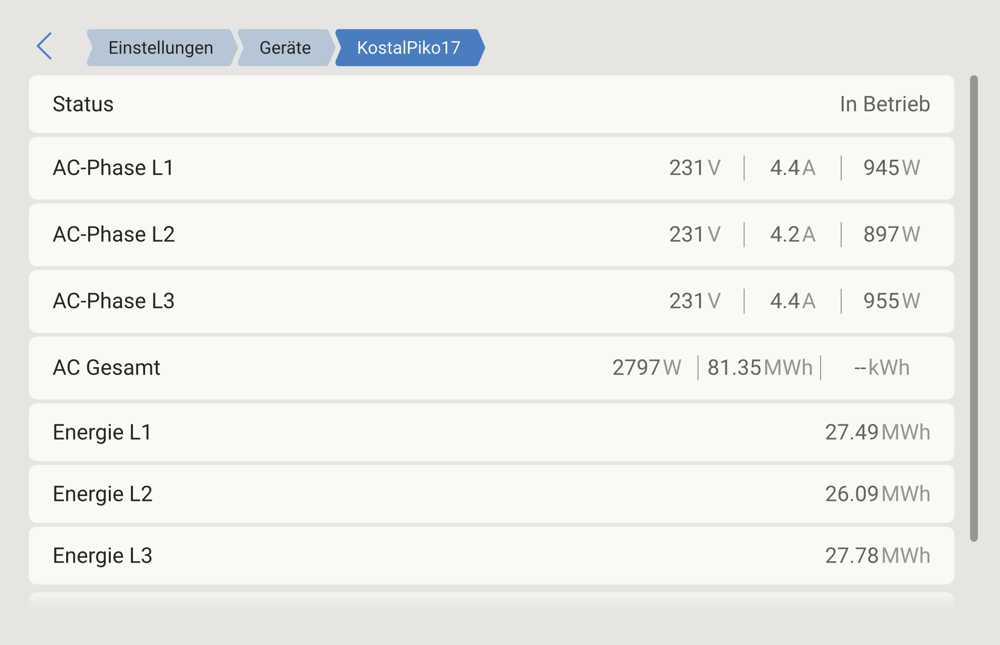
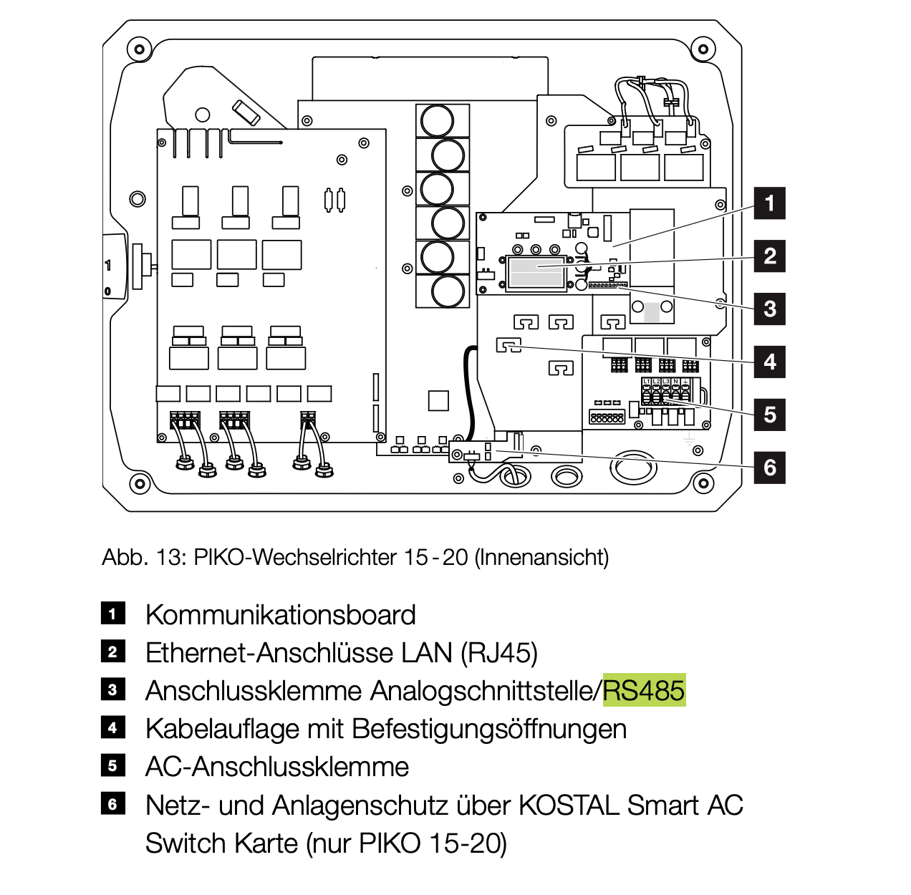
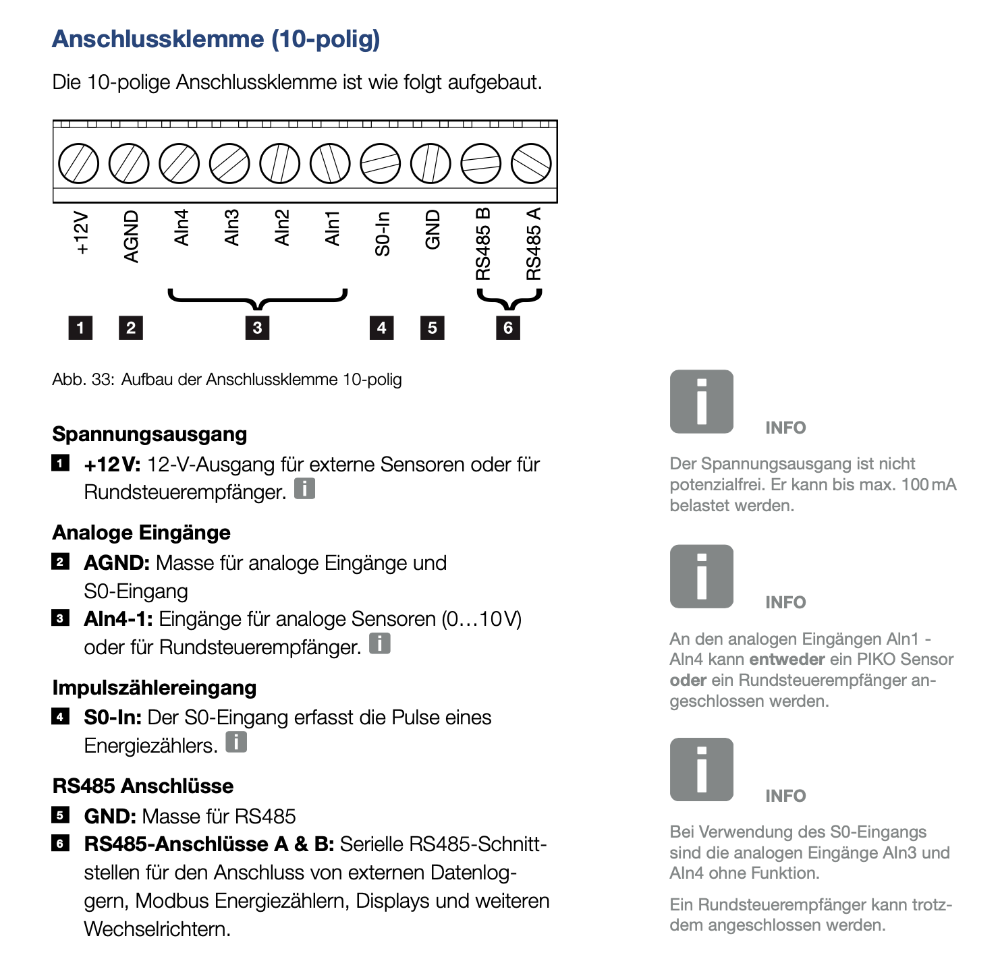
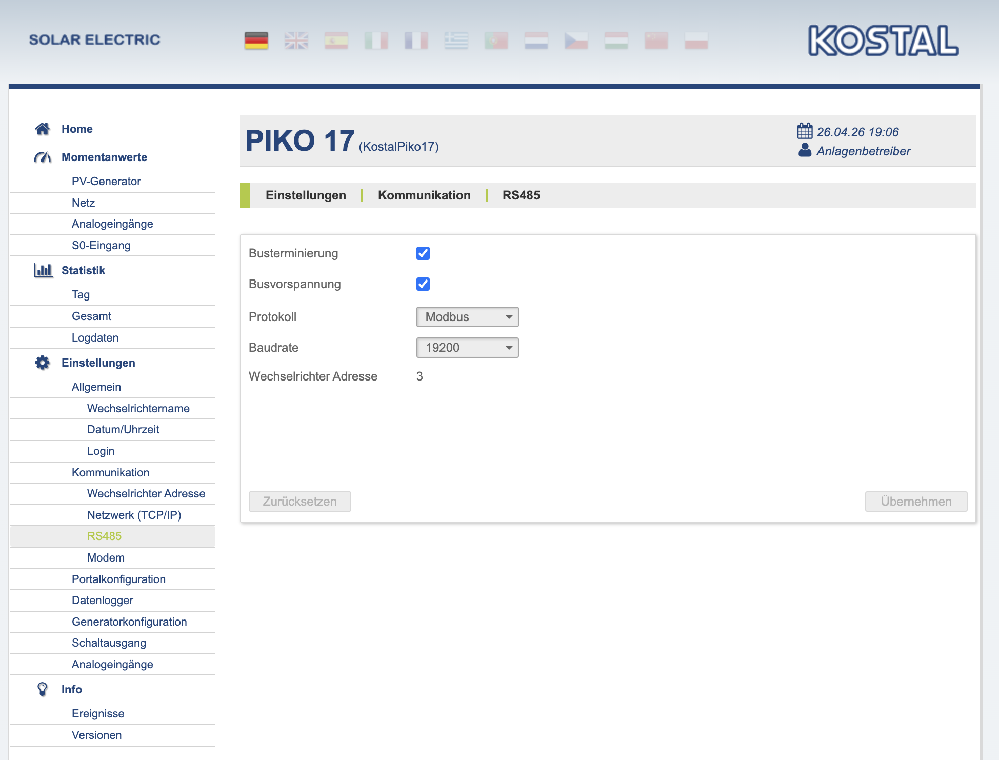
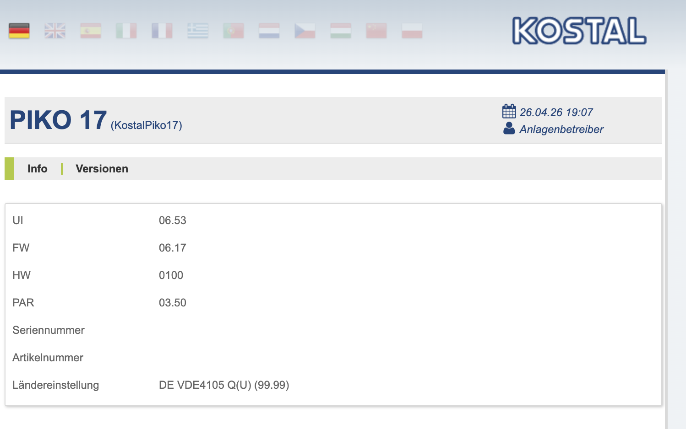
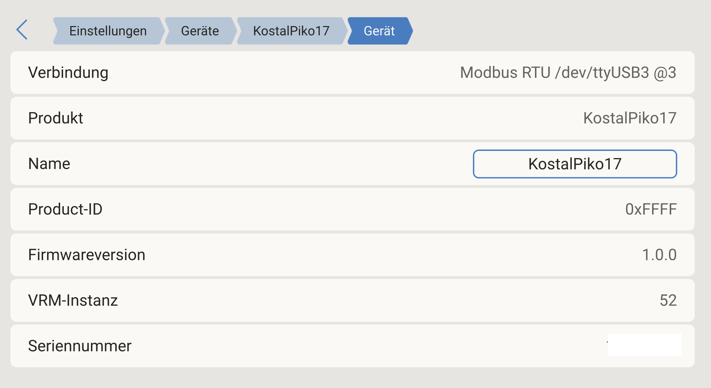

# dbus-kostal-piko

Integrates older Kostal Piko solar inverters (Piko 5.5 -- Piko 20) into Victron Energy's VenusOS via Modbus RTU over RS485.

Tested on: **Kostal Piko 17** with Victron **Cerbo GX** (VenusOS v3.72)



## Table of Contents

- [Features](#features)
- [Hardware Requirements](#hardware-requirements)
- [Wiring](#wiring)
- [Modbus Settings on the Piko](#modbus-settings-on-the-piko)
- [Installation](#installation)
- [Screenshots](#screenshots)
- [Configuration](#configuration)
- [Modbus Register Map](#modbus-register-map)
- [Alternative: HTTP API (dxsEntries)](#alternative-http-api-dxsentries)
- [Troubleshooting](#troubleshooting)
- [Uninstall](#uninstall)
- [License](#license)

## Features

- 3-phase AC data (voltage, current, power per phase)
- 3 DC string data (voltage, current, power)
- Grid frequency
- Daily energy yield (exact, register 30056)
- Total lifetime energy (exact, 32-bit register 30051+30052)
- Operating hours (register 30054)
- Auto-reconnect on communication errors
- Survives VenusOS firmware updates
- No rootfs modifications -- everything lives in `/data/`

## Hardware Requirements

- Kostal Piko inverter (old series, not Piko IQ/Plenticore)
- USB-to-RS485 adapter (FTDI recommended) -- [example on Amazon](https://www.amazon.de/dp/B081NBCJRS)
- Victron GX device (Cerbo GX, Venus GX, Raspberry Pi with VenusOS)

## Wiring

The RS485 terminal is located on the communication board inside the Piko (item 3 in the diagram):



The 10-pin terminal pinout -- use the **GND**, **A**, and **B** pins on the right side:



Connect the RS485 adapter to the Piko's RS485 terminal:
- **GND** --> RS485 adapter GND
- **A (D-)** --> RS485 adapter A/D-
- **B (D+)** --> RS485 adapter B/D+
- Optional: 120 Ohm termination resistor between A and B

## Modbus Settings on the Piko

Configure via the Piko's web interface under *Einstellungen > Kommunikation > RS485*:



- **Bustermination**: enabled
- **Protocol**: Modbus
- **Baud rate**: 19200
- **Slave address**: 3 (or whatever you set in config.ini)

You can find your Piko's firmware version under *Info > Versionen*:



## Installation

1. SSH into your GX device:
   ```bash
   ssh root@<gx-ip>
   ```

2. Download and extract the driver:
   ```bash
   cd /data/etc
   wget -O /tmp/dbus-kostal-piko.tar.gz https://github.com/thenebu/dbus-kostal-piko/archive/refs/heads/main.tar.gz
   tar xzf /tmp/dbus-kostal-piko.tar.gz
   mv dbus-kostal-piko-main dbus-kostal-piko
   rm /tmp/dbus-kostal-piko.tar.gz
   ```

3. Run the installer:
   ```bash
   bash /data/etc/dbus-kostal-piko/install.sh
   ```
   The interactive setup wizard will guide you through:
   - Selecting the USB-RS485 adapter
   - Setting the Modbus slave address
   - Auto-detecting inverter name, serial number and rated power
   - Choosing the AC position and VRM instance

   The installer automatically downloads all dependencies (velib_python),
   generates `config.ini`, and creates the service.

4. Verify:
   ```bash
   svstat /service/dbus-kostal-piko
   # Should show: up (pid XXXXX) N seconds

   tail -f /var/log/dbus-kostal-piko/current | tai64nlocal
   # Should show: Piko: 12345W | L1: ... | L2: ... | L3: ...
   ```

To re-run the setup wizard later:
```bash
bash /data/etc/dbus-kostal-piko/install.sh --setup
```

## Screenshots

### PV Inverter Overview
3-phase AC data with per-phase voltage, current, power, and energy:


### Device Info
Device details showing Modbus RTU connection, serial number, and VRM instance:



### Piko RS485 Configuration
Modbus settings in the Piko's web interface:


### Piko Firmware Versions
Tested with UI 06.53 / FW 06.17:


## Configuration

See `config.sample.ini` for all options with descriptions.

Key settings:
- `port`: USB serial device (find with `dmesg | grep ttyUSB`)
- `slave_address`: Must match the Piko's RS485 address setting
- `position`: 0=AC input 1, 1=AC output, 2=AC input 2
- `device_instance`: Unique VRM instance ID (default: 52)

## Modbus Register Map

Reverse-engineered and verified against the Piko's HTTP API.

### DC Strings (3x)

| Register | Value       | Scale |
|----------|-------------|-------|
| 30001    | DC1 Voltage | /10 V |
| 30002    | DC1 Current | /100 A|
| 30003    | DC1 Power   | W     |
| 30006-08 | DC2         | same  |
| 30011-13 | DC3         | same  |

### AC Phases (3x)

| Register | Value       | Scale |
|----------|-------------|-------|
| 30016    | L1 Voltage  | /10 V |
| 30017    | L1 Current  | /100 A|
| 30018    | L1 Power    | W     |
| 30020-22 | L2          | same  |
| 30024-26 | L3          | same  |

### Totals & Energy

| Register     | Value                | Scale            |
|--------------|----------------------|------------------|
| 30029        | DC Total Power       | W                |
| 30031        | AC Total Power       | W                |
| 30033        | Cos φ                | /100             |
| 30034        | Grid Frequency       | /10 Hz           |
| 30044        | Rated Power          | W                |
| 30051--30052 | Total Lifetime Yield | Wh, 32-bit BE    |
| 30054        | Operating Hours      | h                |
| 30056        | Daily Yield          | Wh               |

Notes verified against the Piko's web interface on a Piko 17:
- 30051+30052 (32-bit BE) is the *exact* lifetime energy in Wh -- divide by 1000 for kWh.
- 30054 holds the operating hour counter (matches *Info > Statistik* on the Piko).
- 30056 is the daily yield in Wh, reset at midnight.
- Earlier driver versions used `regs[37] / 1000` (30038) for daily and `regs[38] * 3` (30039) as a `kWh-per-string * 3` heuristic for total. Both were wrong. The 30038 register is *not* a daily counter; it can decrease while the inverter is producing.

### Device Info

| Register  | Value         | Type   |
|-----------|---------------|--------|
| 30071-83  | Device Name   | ASCII  |
| 30084-96  | Serial Number | ASCII  |

Connection: **19200 baud, 8E1, FC03 (Holding Registers)**

## Alternative: HTTP API (dxsEntries)

The older Piko inverters also expose data via an HTTP JSON API on their built-in web interface. This can be useful if RS485 is not an option or for retrieving the exact total energy value.

**Endpoint:** `http://<piko-ip>/api/dxs.json?dxsEntries=<id>&dxsEntries=<id>&...`

### Available dxsEntries

| dxsId      | Description      | Unit |
|------------|------------------|------|
| 33555201   | DC1 Current      | A    |
| 33555202   | DC1 Voltage      | V    |
| 33555203   | DC1 Power        | W    |
| 33555457   | DC2 Current      | A    |
| 33555458   | DC2 Voltage      | V    |
| 33555459   | DC2 Power        | W    |
| 33555713   | DC3 Current      | A    |
| 33555714   | DC3 Voltage      | V    |
| 33555715   | DC3 Power        | W    |
| 33556736   | DC Total Power   | W    |
| 67109120   | AC Total Power   | W    |
| 67109377   | AC L1 Current    | A    |
| 67109378   | AC L1 Voltage    | V    |
| 67109379   | AC L1 Power      | W    |
| 67109633   | AC L2 Current    | A    |
| 67109634   | AC L2 Voltage    | V    |
| 67109635   | AC L2 Power      | W    |
| 67109889   | AC L3 Current    | A    |
| 67109890   | AC L3 Voltage    | V    |
| 67109891   | AC L3 Power      | W    |
| 16780032   | Operating Status | enum (3=feeding) |
| 251658753  | Total Energy     | kWh  |
| 251659009  | Daily Energy     | kWh  |

### Example Request

```bash
curl "http://192.168.2.64/api/dxs.json?dxsEntries=67109120&dxsEntries=251658753"
```

```json
{
  "dxsEntries": [
    {"dxsId": 67109120, "value": 12505.64},
    {"dxsId": 251658753, "value": 81182.39}
  ]
}
```

### Why this driver uses RS485 instead

| | RS485 (Modbus RTU) | HTTP API (dxsEntries) |
|---|---|---|
| **Reliability** | Direct serial connection, no network dependency | Requires functioning Ethernet/WiFi on the Piko |
| **Latency** | ~100ms per poll | ~500-1000ms per request |
| **Network** | Works without LAN/IP infrastructure | Piko must be on the same network as the GX |
| **Availability** | Always responds while inverter has power | Web server can hang, no watchdog |
| **Firmware updates** | Protocol is stable, hardware-level | Piko firmware updates could change API |
| **Multi-device** | RS485 bus supports multiple devices on one cable | Each device needs its own IP and HTTP request |
| **Total Energy** | Exact (32-bit register 30051+30052) | Exact value |
| **Daily Energy** | Exact (register 30056) | Sometimes returns 0 (broken on some firmware) |

For most installations, RS485 is the better choice. The HTTP API is useful as a secondary data source or if no RS485 adapter is available.

## Troubleshooting

**Service keeps restarting:**
Check logs: `cat /var/log/dbus-kostal-piko/current | tai64nlocal`

**"No response" errors:**
- Check wiring (A/B not swapped?)
- Check slave address matches Piko setting
- Check baud rate matches Piko setting
- Is another service using the port? `fuser /dev/ttyUSB3`

**serial-starter claims the port:**
The install script stops the conflicting service automatically. If it doesn't work:
```bash
# Manually stop the conflicting service
svc -d /service/dbus-modbus-client.serial.ttyUSB3
```

**Per-phase energy is synthetic:**
The Piko does not expose per-phase energy registers. The driver splits the total lifetime energy (from the 32-bit register pair 30051+30052) equally across L1/L2/L3 for the `/Ac/L*/Energy/Forward` paths. The total `/Ac/Energy/Forward` value itself is exact.

## Uninstall

```bash
bash /data/etc/dbus-kostal-piko/uninstall.sh
```

## License

MIT
